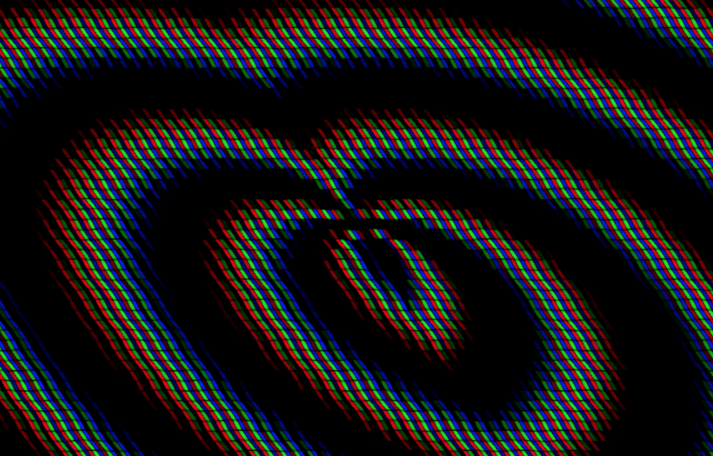

# Fragment Shader Testing Grounds

A simple THREE.js shader implementation I played around with while absorbing Patricio Gonzalez's lovely Fragment shader guide, [The Book of Shaders](https://thebookofshaders.com/)